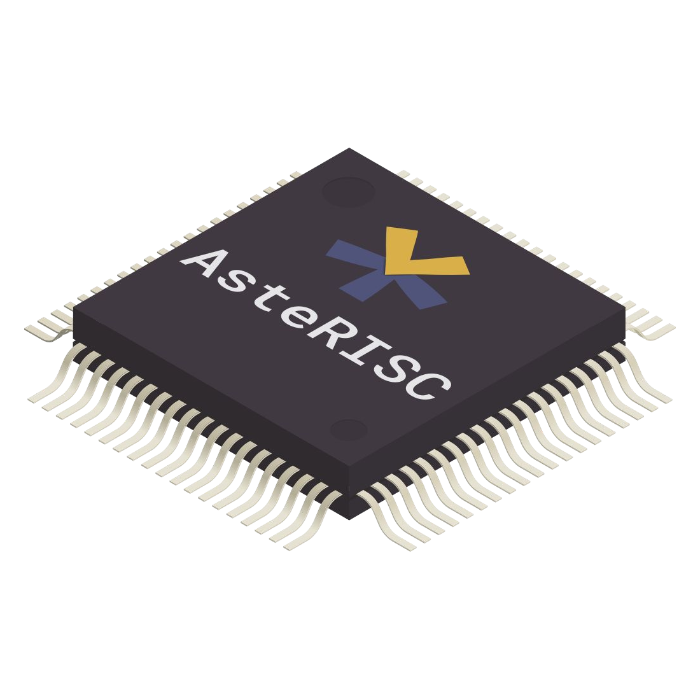

# AsteRISC-core

## Overview

AsteRISC is a flexible multi-cycle RISC-V core designed for design space exploration. 

It is written in platform-independent SystemVerilog and targets both FPGAs and ASIC technologies.

Supported RISC-V extensions: `RV32`[`I`/`E`][`M`][`C`][`Zicsr`]

## Key Features

- Architectural flexibility for generating a wide array of microarchitectures.
- Designed to cater to diverse performance requirements and application scenarios.
- Suited for both FPGA and physical (ASIC) implementation.

## AsteRISC Environment

The AsteRISC RISC-V core is part of a comprehensive environment meant to generate and compare AsteRISC configurations based on various metrics for specific applications. This environment facilitates finding the microarchitecture that best fits application constraints.

Find the complete AsteRISC environment [here](https://github.com/jsaussereau/AsteRISC).

## Contact

For any inquiries or support, feel free to contact me at jonathan.saussereau@ims-bordeaux.fr.

*Note: AsteRISC is under active development, and we appreciate your feedback and contributions to make it even more powerful and user-friendly.*
